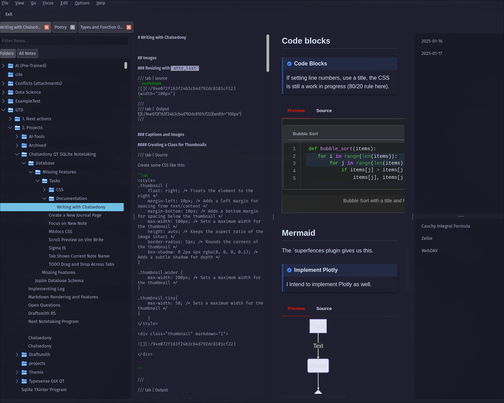

# Chalsedony - A Modern Note-Taking Application

Chalsedony is an open-source note-taking application built with Python and Qt, designed for compatability with [Joplin](https://github.com/laurent22/joplin) it aims to bring a performant keyboard centric UI.



## Key Features

✨ **Modern Qt Interface**
Enjoy a sleek, responsive user interface with dark/light mode support, zoom and Neovim Integration.

📚 **SQLite Backend**
Notes are stored in a reliable SQLite database with full compatability with Joplin, this gives us free Full Text Search and no broken links.

🔗 **Note Linking**
Create connections between notes with a keyboard shortcut for inserting links (No Plugins needed!)

📅 **Journal Integration**
Built-in Keyboard shortcut to focus on today's journal entry (`YYYY-MM-DD`)

🔍 **Search**
Uses the Same FTS as Joplin (FTS4 right now `#TODO upgrade to FTS5`)

📝 **Markdown pymdown extensions**
Write and preview notes using Markdown with some extra features like admonitions.

⚙️ **Hackable**
Edit the source!

## Getting Started

### Prerequisites

* `uv`

### Installation

```bash
uv tool install git+https://github.com/ryangreenup/chalsedony
cy
```

### Uninstallation

```bash
uv tool uninstall chalsedony
```

## Contributing

PR's Welcome!

## License

Chalsedony is released under the GPL License.

## Why Chalsedony?

I figure Chalsedony is a gemstone like Obsidian, but it's a bit more clear and versatile.

## Warning!

Backup `~/.config/joplin-desktop` before using this application, it's rough around the edges and comes with no warranty.

Be particularly careful of the Neovim IPC stuff, it's a bit experimental and tends to crash. **MAKE BACKUPS!**.

I also recommend `WAL` mode so you can have multiple instances open:

```sh
sqlite3 ~/.config/joplin-desktop/database.sqlite < "PRAGMA journal_mode = 'WAL'"
```

## TODO Documentation

There are some additional features like datatables


    /// tab | Previw
    /// note | Admonitions
    This is a note
    ///
    ///
    ///tab | Source
    ```markdown
    /// note | Admonitions
    This is a note
    ///
    ```
    ///
    ///tab | HTML
    ```html
    <div class="admonition" markdown="1">
    <p class="admonition-title" markdown="1"> Some title</p>
    <p>Some content</p>
    </div>
    ```
    ///


    ```mermaid
    graph TD
        A[Hard] -->|Text| B(Round)
        B --> C{Decision}
        C -->|One| D[Result 1]
        C -->|Two| E[Result 2]
    ```


    [=85% "85%"]{: .candystripe}
    [=100% "100%"]{: .candystripe .candystripe-animate}
    [=0%]{: .thin}
    [=5%]{: .thin}
    [=25%]{: .thin}
    [=45%]{: .thin}
    [=65%]{: .thin}
    [=85%]{: .thin}
    [=100%]{: .thin}


    Aligned images:

    {width="100px" align=right}

    Captions:

    
    /// caption
        attrs: {class: "thumbnail tiny"}
    A Caption
    ///


    Datatables


    /// tab | Output
    /// html | div.dataTablesContainer[style='border: 1px solid red;']

    | Name                | Position                  | Office        | Age | Start date | Salary    |
    |---------------------|---------------------------|---------------|-----|------------|-----------|
    | Tiger Nixon         | System Architect          | Edinburgh     | 61  | 2011-04-25 | \$320,800 |
    | Garrett Winters     | Accountant                | Tokyo         | 63  | 2011-07-25 | \$170,750 |
    | Ashton Cox          | Junior Technical Author   | San Francisco | 66  | 2009-01-12 | \$86,000  |

    ///


    <div
        class="dataTablesContainer"
        markdown="1">
    </div>


## Keyboard Shortcuts

All keyboard shortcuts are documented in the menus and command palette, except for the tree centric ones below (although these should appear in the context menu):

```python
        return [
            self.MenuAction(
                label=f"Copy {item_type} ID: {item_id}",
                handler=lambda: self.copy_id(item_data),
                shortcut="C",
            ),
            self.MenuAction(
                label=f"Change {item_type} ID",
                handler=lambda: self.update_id(item_data),
                shortcut=None,
            ),
            self.MenuAction(
                label="Create Note",
                handler=lambda: self.create_note(item_data),
                shortcut="N",
            ),
            self.MenuAction(
                label="Create Folder",
                handler=lambda: self.create_folder(item_data),
                shortcut="Ctrl+Alt+N",
            ),
            self.MenuAction(
                label=f"Duplicate {item_type}",
                handler=lambda: self.duplicate_item(item_data),
                shortcut="Print",
            ),
            self.MenuAction(
                label=f"Delete {item_type}",
                handler=lambda: self.delete_item(item_data),
                shortcut="Delete",
            ),
            self.MenuAction(
                label="Rename Folder",
                handler=lambda: self.request_folder_rename(item_data),
                shortcut="F2",
            ),
            self.MenuAction(
                label="Move to Root",
                handler=lambda: self.move_folder_to_root(item_data),
                shortcut="0",
            ),
            self.MenuAction(label="Cut", handler=self.cut_selected_items, shortcut="X"),
            self.MenuAction(
                label="Paste",
                handler=lambda: self.paste_items(item_data),
                shortcut="P",
                condition=lambda _: bool(self._cut_items),
            ),
            self.MenuAction(
                label="Clear Cut",
                handler=self.clear_cut_items,
                shortcut="`",
                condition=lambda _: bool(self._cut_items),
            ),
        ]

```

## Contributors

- [Shaira Viaje Greenup](https://github.com/shaira-greenup)
- Ryan Greenup

## References

- [Aider](https://aider.chat/HISTORY.html) was a massive time saver
- [Joplin](https://joplinapp.org/)
    - The Schema was adapted for full compatability
- [Pymdown Extensions](https://facelessuser.github.io/pymdown-extensions/extensions/superfences/)
- [Typer](https://github.com/fastapi/typer)
- [UV](https://github.com/astral-sh/uv)
- [Markdownify](https://pypi.org/project/markdownify/)


